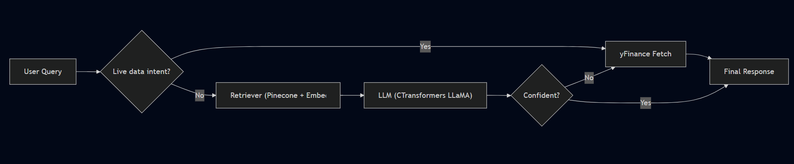

## Finance Chatbot – RAG over Finance Textbook + Live Market Data

A Retrieval-Augmented Generation (RAG) chatbot for finance. It answers questions using a vector index built from a finance textbook and seamlessly falls back to live market data (via yFinance) for ticker-specific queries like price, market cap, P/E ratio, and dividend yield.

Built with Python, Flask, LangChain, Pinecone, HuggingFace embeddings, CTransformers (local LLaMA), and yFinance.

---

### Features

- **RAG over finance textbook**: Ingests PDFs from `data/`, chunks and embeds them, and stores vectors in Pinecone.
- **Optimized retriever (MMR)**: Uses Maximal Marginal Relevance for diverse yet relevant context; `k=3`, `fetch_k=20`.
- **Hybrid behavior via smart fallback**: If the LLM answer is uncertain or the user asks for live data, the app uses yFinance directly.
- **Local LLM via CTransformers**: Runs a local `llama-2-7b-chat.ggmlv3.q4_0.bin` model for private inference.
- **Embeddings tuned for cosine similarity**: Normalized Sentence-Transformers embeddings (`all-MiniLM-L6-v2`).
- **Preprocessing & chunking**: NLTK-driven cleaning, tokenization, stopword removal, lemmatization; 300/50 chunking for better recall.
- **Web UI**: Simple Flask UI at `/` for chatting.

---

### Architecture (Workflow)

High-level flow:

1. **User query (Flask UI)** → `POST /get` in `app.py`.
2. **Intent check**: If query mentions live metrics (price, market cap, etc.), go straight to yFinance.
3. **Retriever**: Otherwise, query Pinecone via LangChain retriever (MMR) using HuggingFace embeddings.
4. **LLM**: The retrieved context and user question are passed to the local LLaMA model through CTransformers.
5. **Answer**: If the LLM says "I don't know", fallback to yFinance. Else, return the generated answer.

Conceptual diagram:



---

### Tech Stack

- **Python** – Core language
- **Flask** – Web server and UI
- **LangChain** – RAG pipeline (chains, retriever, prompts)
- **Pinecone** – Vector database for document chunks
- **HuggingFace Embeddings** – `sentence-transformers/all-MiniLM-L6-v2`
- **CTransformers** – Local LLaMA model runner
- **yFinance** – Live financial data
- **NLTK** – Text preprocessing

---

### Installation

Prerequisites:
- Python 3.10+
- A Pinecone account and API key
- The model file `model/llama-2-7b-chat.ggmlv3.q4_0.bin` present locally

1) Clone and enter the project
```bash
git clone <your-repo-url>
cd finance-bot
```

2) Create and activate a virtual environment (Windows PowerShell)
```powershell
python -m venv .venv
.\.venv\Scripts\Activate.ps1
```

3) Install dependencies
```bash
pip install --upgrade pip
pip install -r requirement.txt
```

4) Configure environment variables
Create a `.env` file in the project root:

```bash
# .env
PINECONE_API_KEY=YOUR_PINECONE_API_KEY
# Optional (defaults shown in code)
PINECONE_CLOUD=aws
PINECONE_REGION=us-east-1
```

---

### Usage

There are two steps: (A) index your documents to Pinecone, then (B) run the chatbot server.

A) Build the index (RAG store)
```bash
python store_index.py
```
- Loads PDFs from `data/`
- Cleans and chunks them
- Creates/uploads embeddings to Pinecone in index `finance-chatbot`, namespace `finance`

B) Start the chatbot
```bash
python app.py
```
- Opens a Flask app (default `http://127.0.0.1:5000`)
- Visit `/` to chat via the provided UI

---

### Example Queries

RAG over textbook (knowledge questions):
- "Explain moving averages and how they are used in trend analysis."
- "What is the difference between support and resistance?"
- "Describe the MACD indicator and its interpretation."

Live market data (fallback via yFinance):
- "What is AAPL stock price today?"
- "Show MSFT market cap."
- "What is TSLA P/E ratio?"
- "Dividend yield of JNJ?"

Tip: The app auto-detects common finance keywords (price, market cap, PE ratio, dividend) to shortcut straight to yFinance.

---

### Optimization Notes

- **Preprocessing**: Text is lowercased, cleaned of special characters, tokenized, stopwords removed, and lemmatized (NLTK) for better chunk quality.
- **Chunking**: `chunk_size=300`, `chunk_overlap=50` balances coverage and retrieval accuracy.
- **Embedding normalization**: `normalize_embeddings=True` improves cosine distance behavior in Pinecone.
- **Retriever (MMR)**: `search_type="mmr"` with `k=3` and `fetch_k=20` improves diversity while keeping high relevance.
- **Deduplication**: Simple hash-based filtering removes duplicate chunks to reduce index noise and cost.
- **Local inference**: CTransformers enables CPU-only local inference for privacy and cost control.

---

### Project Structure

```
finance-bot/
├─ app.py                # Flask app; routes, retriever, LLM, yFinance fallback
├─ store_index.py        # Document loading, chunking, embeddings, Pinecone upload
├─ src/
│  ├─ helper.py          # Preprocessing, chunking, embeddings, yFinance helpers
│  └─ prompt.py          # System prompt template
├─ data/                 # PDFs (e.g., finance textbook)
├─ model/                # Local LLaMA model file (.bin)
├─ templates/
│  └─ chat.html          # Minimal chat UI
├─ static/
│  └─ style.css          # UI styling
└─ requirement.txt       # Python dependencies
```

---

### Limitations & Future Work

- **RAG, not fine-tuned**: The LLM is not fine-tuned on finance; answers rely on retrieved context and prompt quality.
- **Local model constraints**: Response quality/speed depends on the local model and hardware; consider hosted models for throughput.
- **yFinance dependency**: Live data quality and fields depend on upstream sources.
- **Future enhancements**:
  - Add query caching and response caching (e.g., Redis) to reduce latency and cost.
  - Implement hybrid retrieval (BM25 + vector) or reranking models for improved recall.
  - Add source highlighting and citations in UI.
  - Streaming responses and typing indicators in the chat UI.
  - Fine-tune or use a stronger instruction-tuned model for better reasoning.

---

### Credits

- **LangChain** – RAG components and integrations
- **Pinecone** – Vector database
- **HuggingFace** – Sentence-Transformers embeddings
- **CTransformers** – Local LLaMA inference
- **yFinance** – Market data access
- **NLTK** – NLP preprocessing
- The finance textbook used in `data/` for educational purposes

---

### Troubleshooting

- Ensure the model file exists at `model/llama-2-7b-chat.ggmlv3.q4_0.bin`.
- Verify `.env` contains a valid `PINECONE_API_KEY` and the Pinecone region matches your account.
- If you see tokenizer-related errors, NLTK resources are auto-downloaded in `src/helper.py`, but ensure internet access on first run.
- If Pinecone SDK errors occur, confirm the `pinecone` package is installed (this project uses the new `pinecone` package, not `pinecone-client`).

---

### License

See `LICENSE`.


